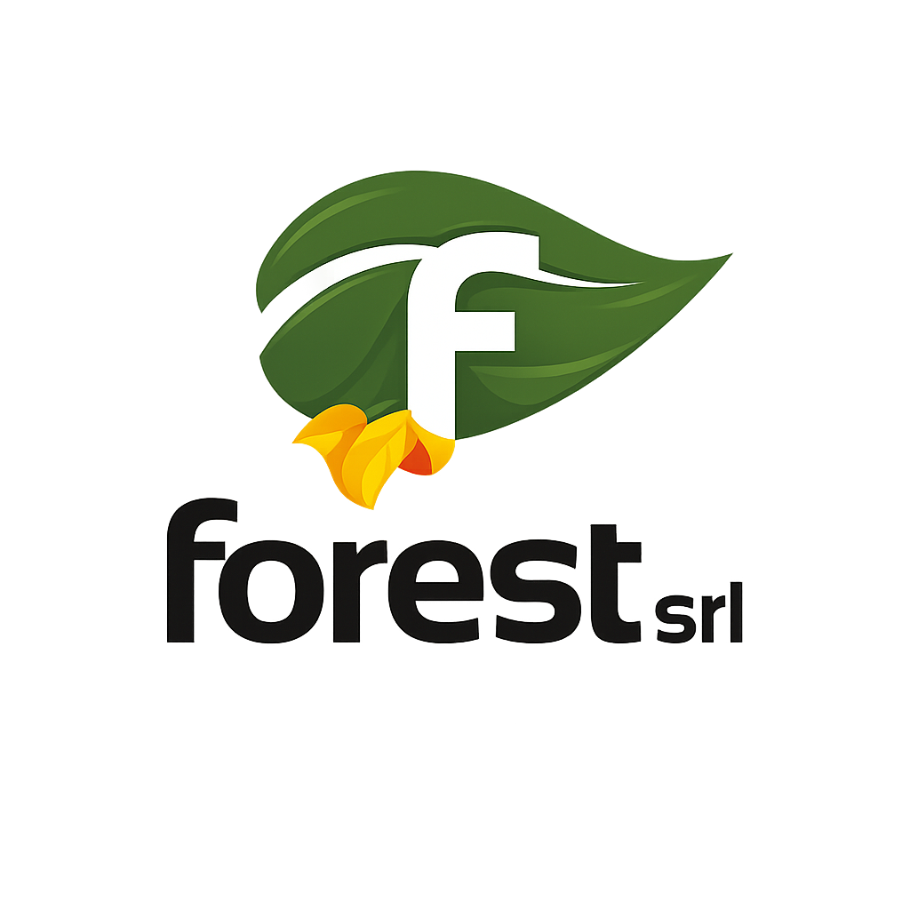
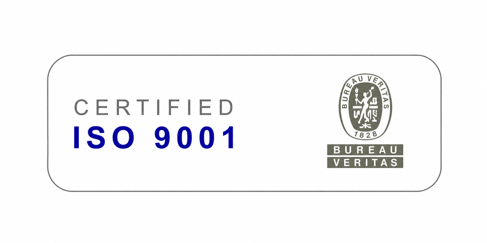
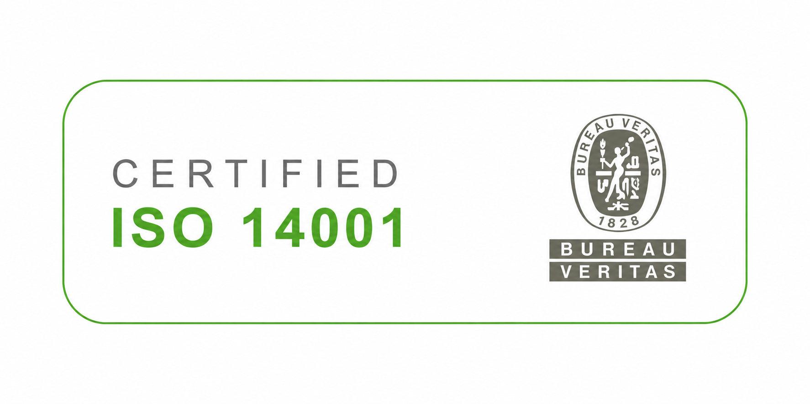
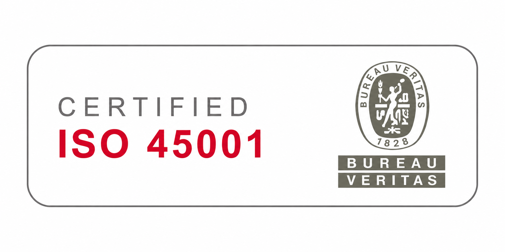
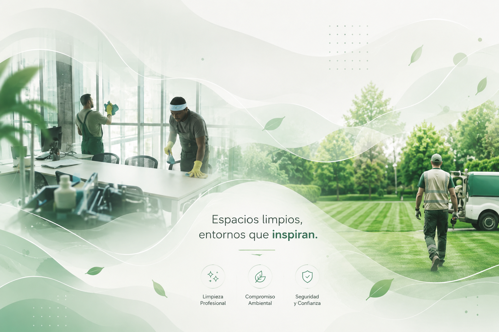
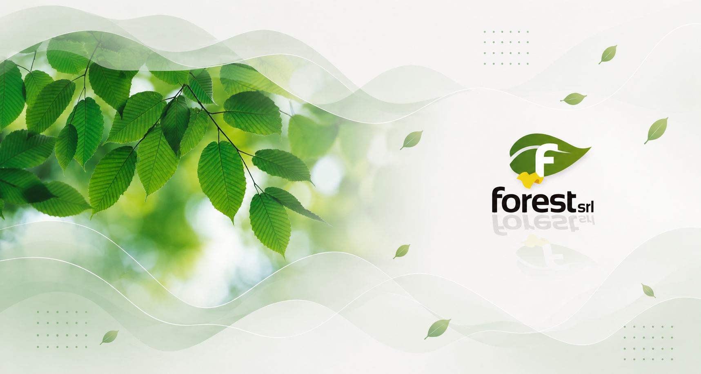
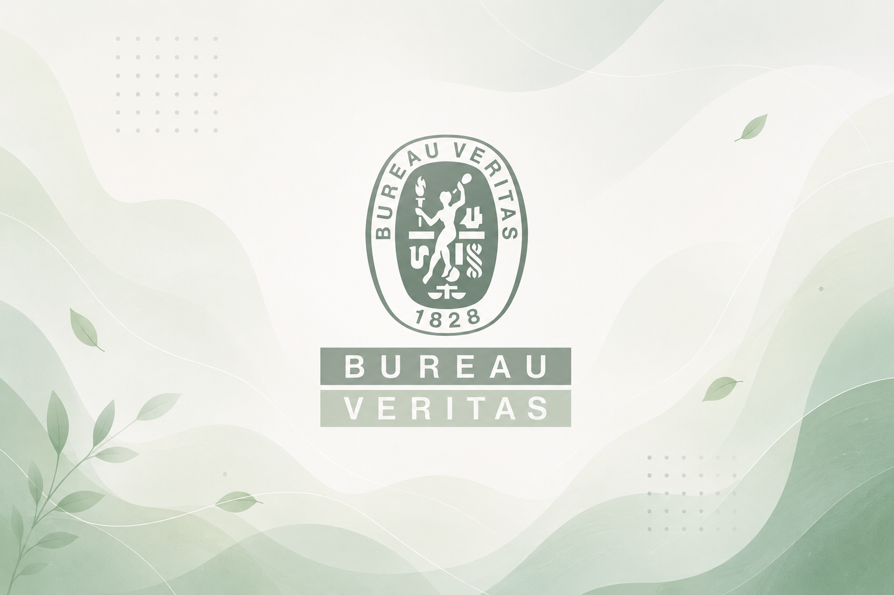

# Forest SRL — Sitio Web Corporativo

Sitio web institucional de **Forest SRL**, empresa de limpieza profesional y mantenimiento de espacios verdes con más de 30 años de trayectoria en Córdoba, Argentina. Certificaciones ISO 9001, ISO 14001 e ISO 45001.

---

## Vista general



---

## Tecnologías utilizadas

| Tecnología | Uso |
|---|---|
| HTML5 / CSS3 | Estructura y estilos (sin frameworks externos) |
| JavaScript vanilla | Animaciones, lógica de calendario y UI |
| PHP + PHPMailer | Envío de formularios por email |
| EmailJS | Confirmaciones de reunión por email (lado cliente) |
| Firebase Realtime Database | Persistencia de turnos reservados (anti-solapamiento) |
| GSAP + ScrollTrigger | Animaciones de scroll y entrada de elementos |
| Google Fonts — DM Sans | Tipografía principal |

---

## Estructura de archivos

```
web-forest/
├── index (5).html                  # Página principal
├── enviar.php                      # Backend de formularios (presupuesto y CV)
├── PHPMailer/                      # Librería PHPMailer para envío SMTP
│   ├── PHPMailer.php
│   ├── SMTP.php
│   ├── Exception.php
│   └── ...
├── assets/
│   ├── logo.png                    # Logo principal de Forest SRL
│   ├── personas.png                # Foto del equipo
│   ├── forest.jpg                  # Imagen corporativa
│   ├── forest1.png                 # Imagen corporativa 2
│   ├── 9001.png                    # Certificación ISO 9001
│   ├── 14001.png                   # Certificación ISO 14001
│   ├── 45001.png                   # Certificación ISO 45001
│   └── bureau-veritas.png          # Logo Bureau Veritas
├── emailjs-template-cliente.html   # Template email confirmación al cliente
├── emailjs-template-forest.html    # Template email notificación interna
└── README.md
```

---

## Secciones de la página

### 1. Navegación flotante
Barra fija con blur de fondo, logo + texto "Forest.", links de sección y botón CTA "Presupuesto". Se oscurece al hacer scroll.

### 2. Hero
Título principal con animación de entrada GSAP. Badge con punto pulsante verde. Logo flotante animado. Dos botones: "Solicitar Presupuesto" y "Conocer Más".

### 3. Carrusel de imágenes
Banda animada con scroll infinito. Muestra:

| Imagen | Descripción |
|---|---|
|  | Certificación ISO 9001 |
|  | Certificación ISO 14001 |
|  | Certificación ISO 45001 |
|  | Logo Forest SRL |
|  | Equipo de trabajo |
|  | Imagen corporativa |
|  | Imagen corporativa 2 |

### 4. Servicios
Tarjetas glassmorphism con efecto 3D tilt al hover. Tres servicios: Limpieza Institucional, Espacios Verdes y Metodología Certificada.

### 5. Certificaciones
Sección con insignias de Bureau Veritas e íconos ISO.



### 6. Clientes
Marquee infinito con nombres de clientes institucionales (Ministerio de Salud, Banco Nación, Poder Judicial, entre otros).

### 7. Nosotros
Estadísticas animadas con contadores, valores de la empresa y política de calidad.

| Imagen | Descripción |
|---|---|
|  | El equipo Forest |
|  | Trabajo en campo |

### 8. Formulario de Presupuesto
Campos: Nombre, Empresa, Email, Teléfono, Servicio requerido. Al enviarse dispara el flujo de reserva de reunión (ver más abajo).

### 9. Trabajá con Nosotros
Formulario de CV con carga de archivo PDF. Campos: Nombre, Email, Teléfono, Puesto de interés.

### 10. Footer
Logo, datos de contacto, navegación rápida y copyright.


---

## Flujo de reserva de reunión (feature oculta)

La sección de agendado **no es navegable directamente**. Solo se activa después de enviar el formulario de presupuesto. El objetivo es que solo empresas con intención comercial real puedan reservar una reunión — los postulantes laborales usan el formulario de CV por separado.

```
1. Empresa llena formulario de presupuesto
         ↓
2. enviar.php envía el mail y redirige con ?enviado=1&tipo=presupuesto
         ↓
3. Popup: "¿Querés agendar una reunión con nosotros?"
         ↓ (Sí)
4. Modal con calendario — elige día y horario (lunes a viernes, 9 a 17 hs)
         ↓
5. EmailJS envía dos mails simultáneos:
   → Cliente:     confirmación con fecha, hora y link de Google Meet
   → Forest SRL:  notificación interna con datos del cliente
         ↓
6. Firebase guarda el turno para evitar que otro lo reserve
```

---

## Configuración de servicios externos

### PHPMailer — `enviar.php`
```
Host:     mail.forestsrl.com.ar
Puerto:   465 (SMTPS)
Usuario:  formularios@forestsrl.com.ar
```

### EmailJS
```
Service ID:           service_8bi64ao
Template cliente:     template_res0bjx       → llega al que reservó
Template Forest SRL:  template_forest_notif  → llega a informacionforest@gmail.com
Public Key:           Y4gSaFN3dhO1ztNeJ
```

Variables usadas en los templates: `{{user_name}}`, `{{user_email}}`, `{{fecha}}`, `{{hora}}`, `{{meet_link}}`, `{{booking_service}}`, `{{to_email}}`

### Firebase Realtime Database
```
Proyecto:  pagina-web-74184
URL:       https://pagina-web-74184-default-rtdb.firebaseio.com
Nodo:      /booked.json
Formato:   { "Mon Jun 09 2026-10": 1 }   ← clave: fecha-hora
```

### Google Meet
```
Link fijo:  https://meet.google.com/hum-dxpp-bbs
```

---

## Animaciones y efectos visuales

| Efecto | Descripción |
|---|---|
| Cursor hoja | Hoja SVG que sigue al mouse con lerp, se agranda sobre elementos interactivos |
| Rama decorativa | SVG lateral con hojas animadas por sistema de ráfagas de viento y cursor |
| Canvas partículas | Nodos flotantes con conexiones que reaccionan al mouse |
| Canvas ondas | Capas de olas verdes animadas en el fondo |
| Scroll reveal | Elementos entran con GSAP al aparecer en el viewport |
| Contadores | Estadísticas se incrementan animadas al llegar con el scroll |
| Tilt 3D | Tarjetas con perspectiva reactiva al movimiento del mouse |
| Marquee | Carrusel de imágenes y lista de clientes en scroll infinito |

---

## Despliegue

Hosting PHP compartido (NutHost). Al subir al servidor renombrar `index (5).html` → `index.html`.

> El servidor actual tiene una versión anterior del sitio. Esta versión nueva aún no ha sido desplegada.

---

## Contacto

**Forest SRL**  
Bv. Los Granaderos 1743, Córdoba, Argentina  
+54 351 702-4934  
info@forestsrl.com.ar
